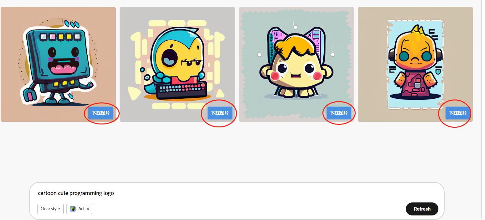
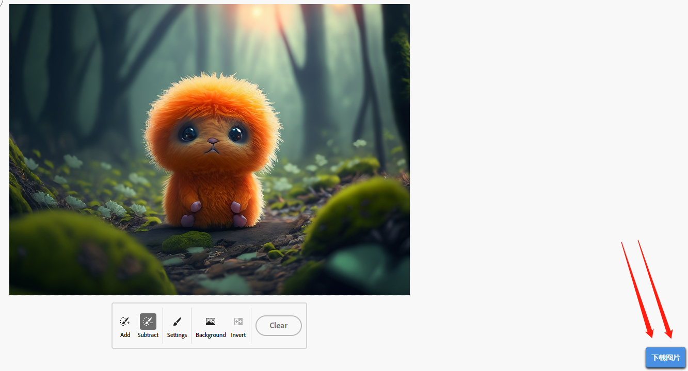

## Adobe Firefly Downloader

This is a user script that enhances the functionality of Adobe Firefly by adding a download button to images and removing watermarks.

这是一个用户脚本，通过为图片添加下载按钮并去除水印，增强了 Adobe Firefly 的功能。

### Features 功能

- Adds a download button to images in Adobe Firefly.
- Removes watermarks from downloaded images.

- 为 Adobe Firefly 中的图片添加下载按钮。
- 从下载的图片中移除水印。

### Installation 安装

To use this user script, you need to have a user script manager installed in your web browser. Here are the steps to install and use the script:

要使用此用户脚本，您需要在您的网络浏览器中安装用户脚本管理器。以下是安装和使用脚本的步骤：

1. Install a user script manager extension:
   - For **Google Chrome**, you can use [Tampermonkey](https://www.tampermonkey.net/) extension.
   - For **Firefox**, you can use [Greasemonkey](https://addons.mozilla.org/en-US/firefox/addon/greasemonkey/) extension.

   1. 安装用户脚本管理器扩展：
      - 对于 **Google Chrome**，您可以使用 [Tampermonkey](https://www.tampermonkey.net/) 扩展。
      - 对于 **Firefox**，您可以使用 [Greasemonkey](https://addons.mozilla.org/en-US/firefox/addon/greasemonkey/) 扩展。

2. Once you have the user script manager installed, click on the following link to install the Adobe Firefly Downloader user script:
   - [Adobe Firefly Downloader](https://github.com/example-user/adobe-firefly-downloader/raw/main/adobe-firefly-downloader.user.js)

    2. 安装用户脚本管理器后，点击以下链接安装 Adobe Firefly Downloader 用户脚本：
       - [Adobe Firefly Downloader](https://github.com/example-user/adobe-firefly-downloader/raw/main/adobe-firefly-downloader.user.js)

3. The user script manager will prompt you to confirm the installation. Click "Install" to proceed.

    3. 用户脚本管理器将提示您确认安装。点击 "Install" 继续。

4. The Adobe Firefly Downloader script is now installed and ready to use.

    4. Adobe Firefly Downloader 脚本已经安装完成，可以开始使用了。

### Usage 使用方法

1. Open Adobe Firefly in your web browser and navigate to the desired page containing images.

   1. 在您的网络浏览器中打开 Adobe Firefly 并导航到包含图片的页面。

2. When images are displayed, you will see download buttons added to each image. Click on the download button to download the image without the watermark.

   2. 图片显示时，您将看到为每张图片添加的下载按钮。点击下载按钮即可下载不带水印的图片。

### Compatibility 兼容性

This user script is compatible with the Adobe Firefly website.

此用户脚本与 Adobe Firefly 网站兼容。

### Contributions 贡献

Contributions to the Adobe Firefly Downloader project are welcome. If you find any issues or have suggestions for improvements, please feel free to open an issue or submit a pull
